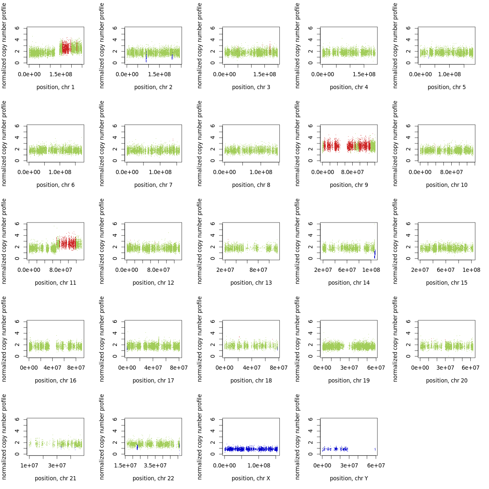

(DNA_CNV)=
# Call CNV
Copy number variant by multiple softwares
## Control-FREEC
Control-FREEC is an software for call CNV from **Tumor/Normal** paired or **Tumor-only** sample. You can find more details here[https://boevalab.inf.ethz.ch/FREEC/tutorial.html#Example]

````{note} 
**FREEC** rule flowchart
```{mermaid}
    :align: center
    %%{init: {'theme': 'base', 'themeVariables': { 'fontSize': '{{ rule_fontsize }}'; } } }%%
    flowchart TD
        T@{ shape: circle, label: T} --> rule@{ shape: hex, label: "FreeC" }
        NC@{ shape: circle, label: NC} --> rule@{ shape: hex, label: "FreeC" }

        rule --> ratio[*_ratios.txt]:::output
        rule --> CNV[*_CNV.txt]:::output

        style T fill:#eb8509,stroke:#333,stroke-width:1px;
        style NC fill:#038c4a,stroke:#f66,stroke-width:1px,color:#fff,font-size:8pt,stroke-dasharray: 5 5
        style rule fill:#eb2409,font-size:8pt
        
        classDef Input fill:#038c4a,stroke:#333,stroke-width:4px;
        classDef software fill:#eb2409,stroke:#333,stroke-width:1px,shape:hex,font-size:8pt;
        classDef output stroke:#00f,font-size:8pt;
```
````

```{admonition} eg. Output of FREEC


```


FreeC need a config file to run, clinder provide an python script to constructed the config file for each sample.